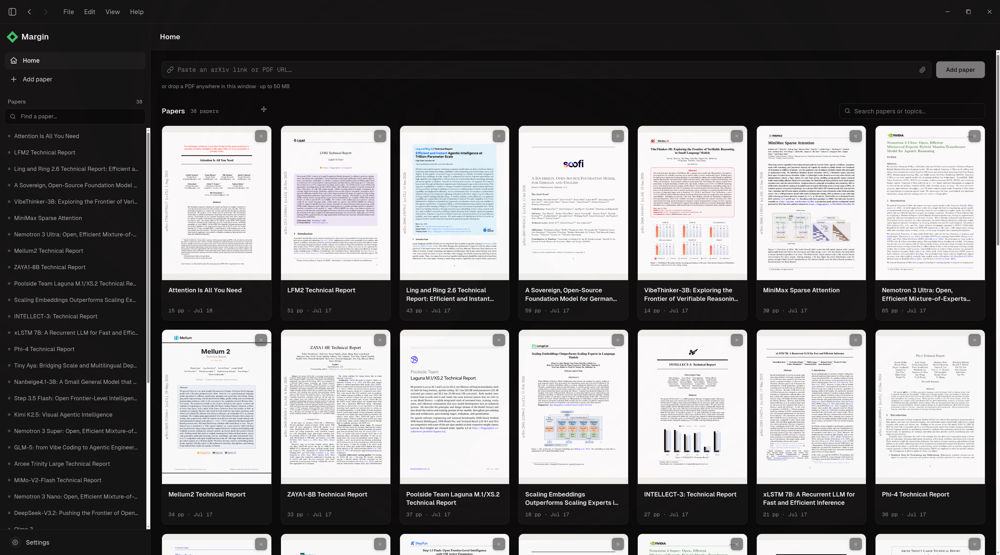
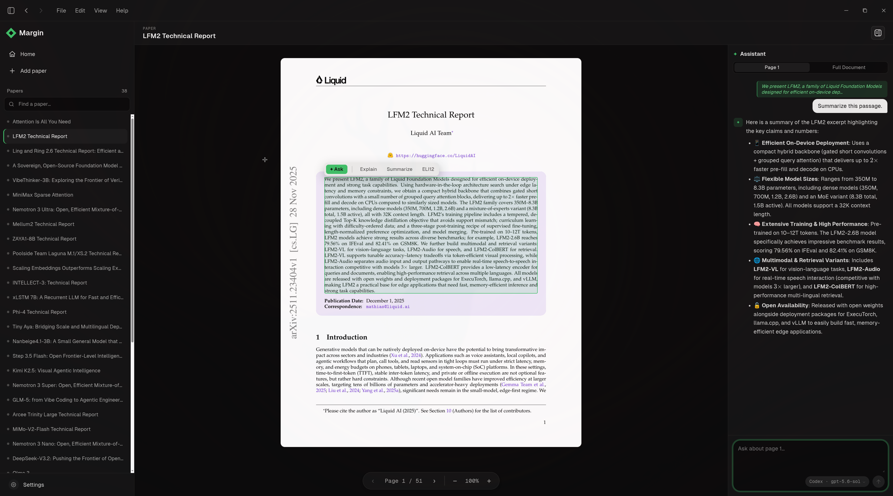

# margin

<p align="center">
  <a href="https://github.com/pavelsimo/margin/releases"></a>
  <a href="https://www.typescriptlang.org/"></a>
  <a href="https://www.electronjs.org/"></a>
  <a href="https://github.com/pavelsimo/margin/releases"></a>
  <a href="https://deepwiki.com/pavelsimo/margin"></a>
</p>

**margin** is a desktop PDF reader with AI built in. Designed with research papers in mind, but it handles any PDF you throw at it.

- **Fast, searchable library.** Drop in PDFs or arXiv links and find anything instantly.
- **Ask questions in context.** Highlight text, equations, tables, or figures and chat about them right there in the paper.
- **Bring your own AI.** Works with any OpenAI-compatible API, or with your favorite coding agent like Codex, Claude Code, and Antigravity. You pick the model and provider. No lock-in.
- **Local-first and private.** Your chats, PDFs, and app data stay on your machine. No tracking, no subscription, no account to create. Remote AI providers only receive the content needed for your request, per their privacy policy.


*Library: first-page previews of your papers; add them from a link or file, then search by title or topic.*


*Reader: select text, tables, figures, or a page region and ask the assistant to explain or summarize it.*

## Shortcuts

`Ctrl/Cmd` means `Ctrl` on Linux and Windows and `Command` on macOS.

### Reader selection

| Gesture | Action |
| --- | --- |
| **Shift-drag** | **Select an exact text, equation, table, or figure region, then use Explain, Summarize, ELI12, or Ask.** |
| Click a block | Select one text, table, or figure block. |
| Ctrl/Cmd-click a block | Add or remove that particular text/table block from a multi-block selection; figures remain single-block selections. |
| Shift-click a block | Select a continuous range of text and table blocks from the selection anchor. |
| Drag | Select the text and table blocks inside the dragged area. |
| Ctrl/Cmd-drag | Add the blocks inside the dragged area to the current selection. |

### PDF reader and chat

| Shortcut | Action |
| --- | --- |
| `PageUp` / `PageDown` | Open the previous / next PDF page. |
| `+` / `-` | Zoom the PDF page in / out. These keys do not change the rest of the app. |
| `Ctrl/Cmd+Shift+B` | Toggle the assistant while reading a paper. |
| `Enter` | Send the question in the assistant. |
| `Shift+Enter` | Insert a new line in the assistant input. |

Reader navigation and PDF zoom are disabled while typing or while a dialog is open.

### Application

| Shortcut | Action |
| --- | --- |
| `Ctrl/Cmd+N` | Go home and focus Add Paper. |
| `Ctrl/Cmd+,` | Open Settings. |
| `Ctrl/Cmd+B` | Toggle the papers sidebar. |
| `Ctrl/Cmd++` / `Ctrl/Cmd+-` | Zoom the entire application in / out. |
| `Ctrl/Cmd+0` | Reset application zoom to 100%. |
| `Alt+Left` / `Alt+Right` | Go back / forward. |
| `Ctrl/Cmd+W` | Close the window. |
| `Ctrl/Cmd+Q` | Quit Margin. |
| `Ctrl/Cmd+R` | Reload Margin. |
| `F11` | Toggle full screen. |

Standard editing shortcuts are also available: `Ctrl/Cmd+Z` (undo), `Ctrl/Cmd+Shift+Z` (redo), `Ctrl/Cmd+X` (cut), `Ctrl/Cmd+C` (copy), `Ctrl/Cmd+V` (paste), and `Ctrl/Cmd+A` (select all).

## Setup

```bash
npm install
npm run dev
```

Data lives in `./data` (override with `MARGIN_DATA_DIR`). It's a plain SQLite DB you can
inspect with `sqlite3 data/margin.db`.

## Scripts

- `npm run dev`: start with hot reload
- `npm run build`: build all bundles to `out/`
- `npm run dist`: build a native installer for the current platform to `release/`
- `npm test`: vitest unit tests (selection, prompt assembly, tag parsing, math normalization)
