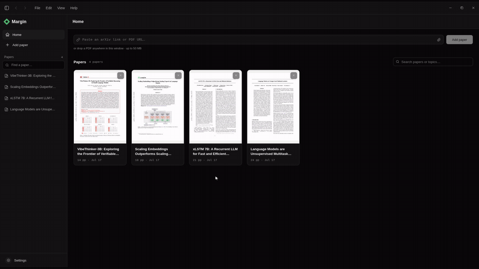

# margin

<p align="center">
  <a href="https://github.com/pavelsimo/margin/releases"></a>
  <a href="https://www.typescriptlang.org/"></a>
  <a href="https://www.electronjs.org/"></a>
  <a href="https://github.com/pavelsimo/margin/releases"></a>
  <a href="https://deepwiki.com/pavelsimo/margin"></a>
</p>

**margin** is a desktop PDF reader with AI built in. Designed with research papers in mind, but it handles any PDF you throw at it.

- **Fast, searchable library.** Drop in PDFs or arXiv links and find anything instantly.
- **Ask questions in context.** Highlight text, equations, tables, or figures and chat about them right there in the paper.
- **Bring your own AI.** Works with any OpenAI-compatible API, or with your favorite coding agent like Codex, Claude Code, and Antigravity. You pick the model and provider. No lock-in.
- **Local-first and private.** Your chats, PDFs, and app data stay on your machine. No tracking, no subscription, no account to create. Remote AI providers only receive the content needed for your request, per their privacy policy.



*Add a paper from an arXiv link, ELI12 any passage, or select a formula and just ask.*

## Setup

```bash
npm install
npm run dev
```

Data lives in `./data` (override with `MARGIN_DATA_DIR`). It's a plain SQLite DB you can
inspect with `sqlite3 data/margin.db`.

## Scripts

- `npm run dev`: start with hot reload
- `npm run build`: build all bundles to `out/`
- `npm run dist`: build a native installer for the current platform to `release/`
- `npm test`: vitest unit tests (selection, prompt assembly, tag parsing, math normalization)

See [Shortcuts](docs/shortcuts.md).
